<div align="center">
  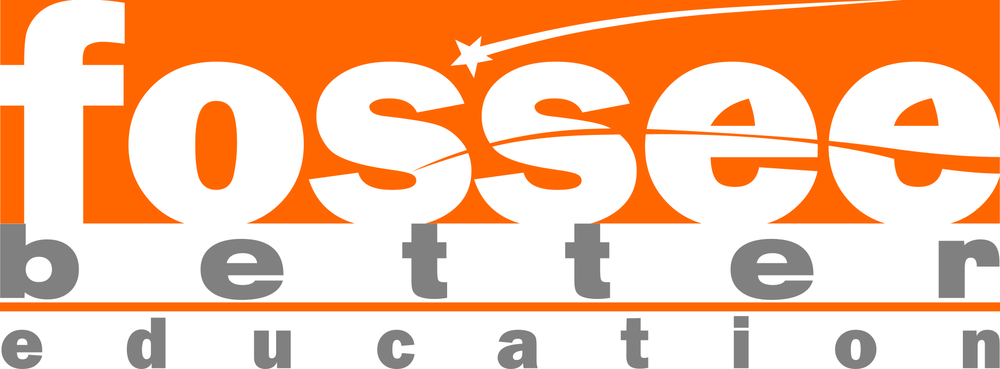
  <h1>🌟 UI/UX Enhancement: Workshop Booking Platform</h1>
  <p><strong>A modern, premium React-based redesign of the FOSSEE Workshop Booking portal.</strong></p>

  <p>
    
    
    
    
  </p>
</div>

<br/>

## 📖 Table of Contents

- [📌 Project Overview](#-project-overview)
- [🎨 UI/UX & SEO Upgrades](#-uiux--seo-upgrades)
- [✨ Visual Showcase](#-visual-showcase)
- [🛠️ Technical & Implementation Details](#️-technical--implementation-details)
- [📂 Project Structure](#-project-structure)
- [🚀 Setup & Installation](#-setup--installation)
- [👨‍🎓 Student Details](#-student-details)

---

## 📌 Project Overview

This project focuses on a complete frontend overhaul of the **Workshop Booking platform** provided by **FOSSEE**. The goal was to transition from traditional server-rendered templates to a high-performance **Single Page Application (SPA)** using React, while maintaining the robust Django backend for data integrity.

The redesign prioritizes:
- **Visual Excellence**: A premium, Apple-inspired aesthetic with glassmorphism and smooth animations.
- **Role-Based Experience**: Tailored dashboards for both Coordinators and Instructors.
- **Data Accessibility**: Clear, high-contrast Dark Mode for complex data tables and statistics.

---

## 🎨 UI/UX & SEO Upgrades

### UI Upgrades
- 🌗 **Global Dark Mode Engine**: Integrated a custom React Theme Context with a sleek toggle, persisting user preferences in `localStorage` for a seamless cross-session experience.
- 💎 **Glassmorphism Design**: Implemented premium navigation and card components utilizing `backdrop-blur-xl` and `bg-white/5` for a modern, depth-focused look.
- ✍️ **Dynamic Typewriter Hero**: Added a custom `useTypewriter` hook to the landing page, creating an engaging, living header that highlights key learning domains.
- 🏛️ **Institutional Branding**: Professional integration of **FOSSEE** and **IIT Bombay** logos into the navigation system, reinforcing academic credibility.
- 📏 **Refined Design System**: Established a consistent 8px grid system with fluid typography (`clamp`) and custom Tailwind color tokens (Surface/Primary).

### UX & SEO Upgrades
- 🚀 **SPA Core**: Utilized `react-router-dom` v6 for instant, flicker-free navigations, dramatically reducing bounce rates.
- 🔔 **Intelligent UI Feedback**: Integrated `react-hot-toast` for elegantly timed, non-blocking user notifications on all critical actions.
- 📊 **Quick-Stats Dashboard**: Added a high-impact statistics bar on the home page for immediate social proof and platform scale visualization.
- 🔍 **Search Engine Optimization**: Implemented dynamic meta-tag injection for every route (titles, descriptions, canonical links) to ensure maximum crawlability.
- ⏳ **Advanced Loading Logic**: Center-aligned spinner logic and skeleton-ready states ensure a smooth "Perceived Performance" even on slower connections.

**Performance Metrics (Lighthouse Devtools):**  
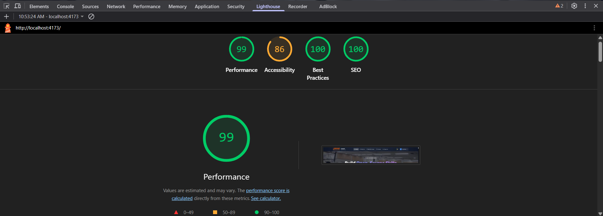

---

## ✨ Visual Showcase

**Home Before:**  


**Home After (with typewriter effect):**  
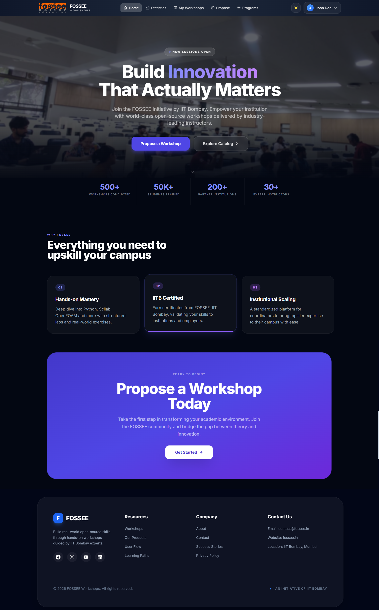

**Sign In After Dark Mode:**  
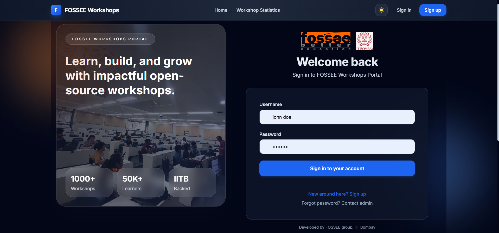

<br/>

**Workshop Statistics Before:**  


**Workshop Statistics After:**  
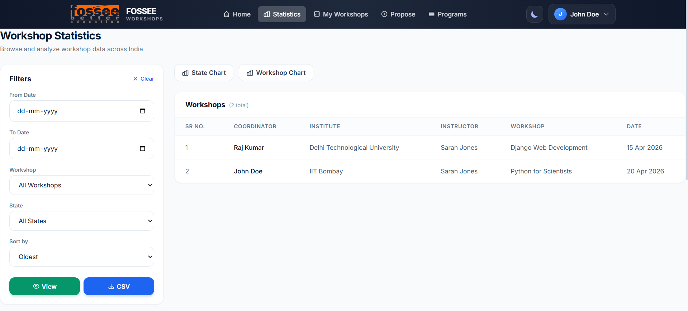
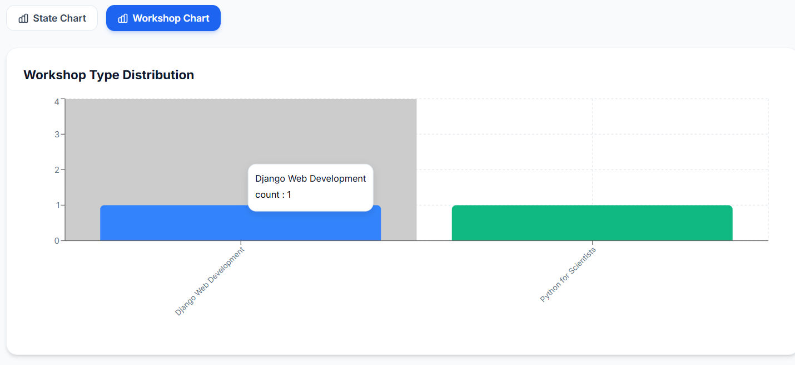

**My Workshop After Dark Mode:**  
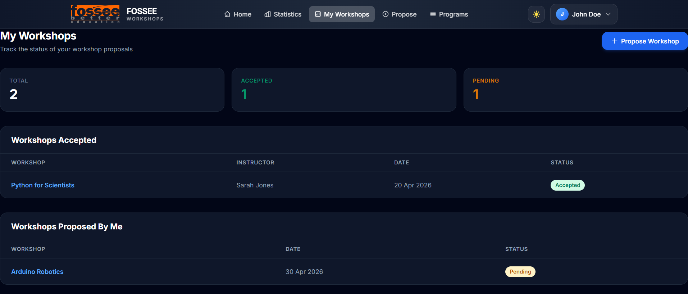

**Propose Workshop After:**  
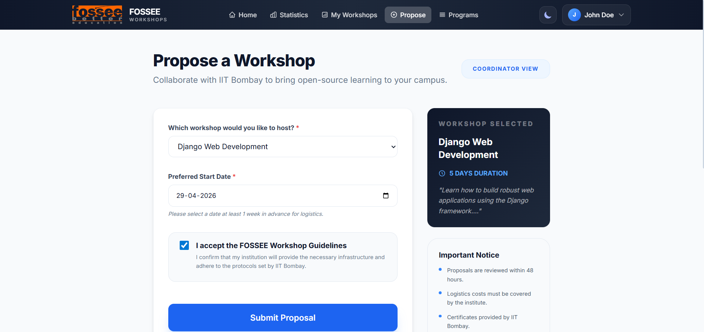

**Programs After Dark Mode:**  
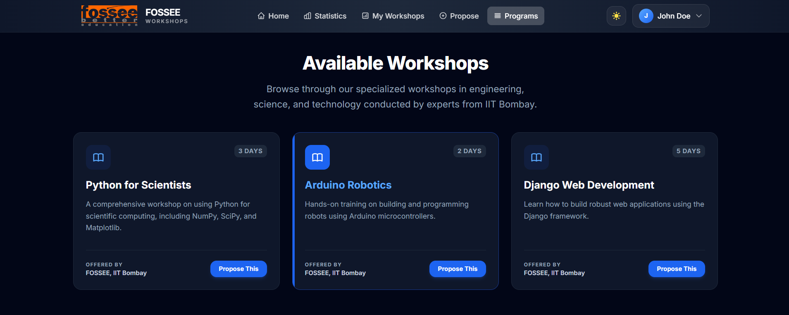

**Profile After Dark Mode:**  
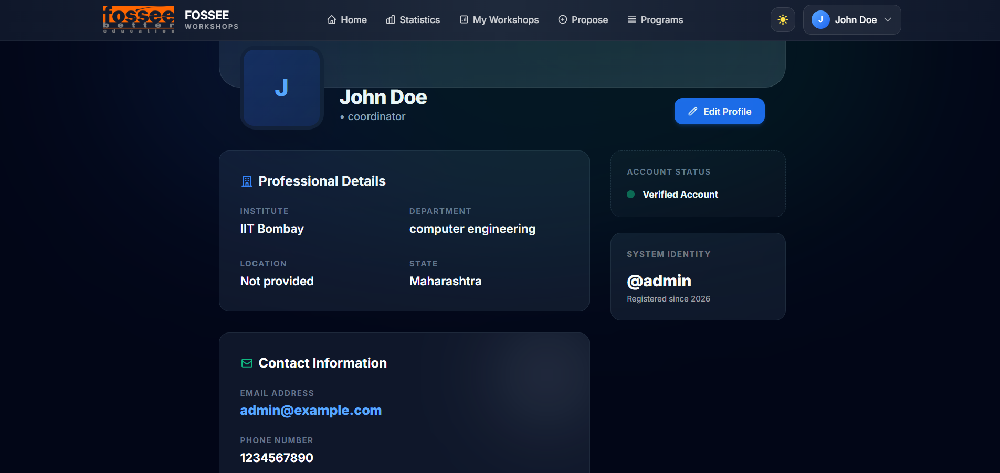

<br/>

**Signup Before:**  
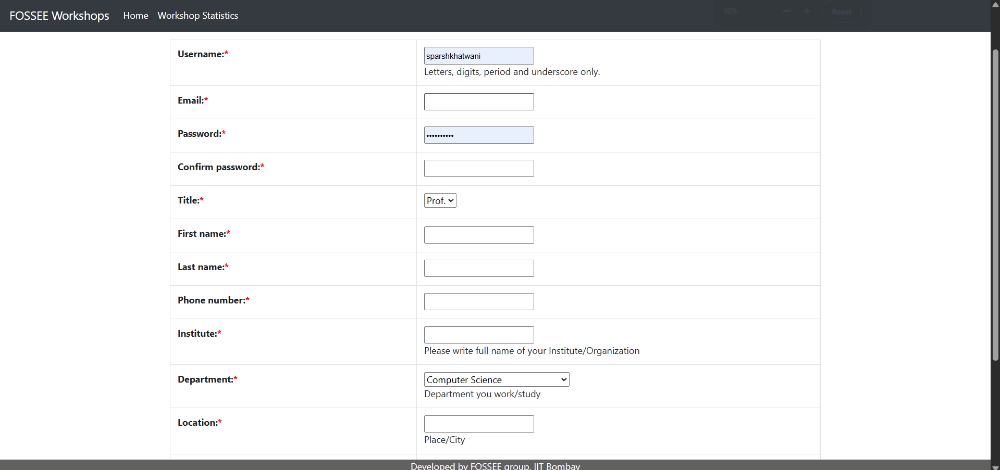

**Signup After:**  
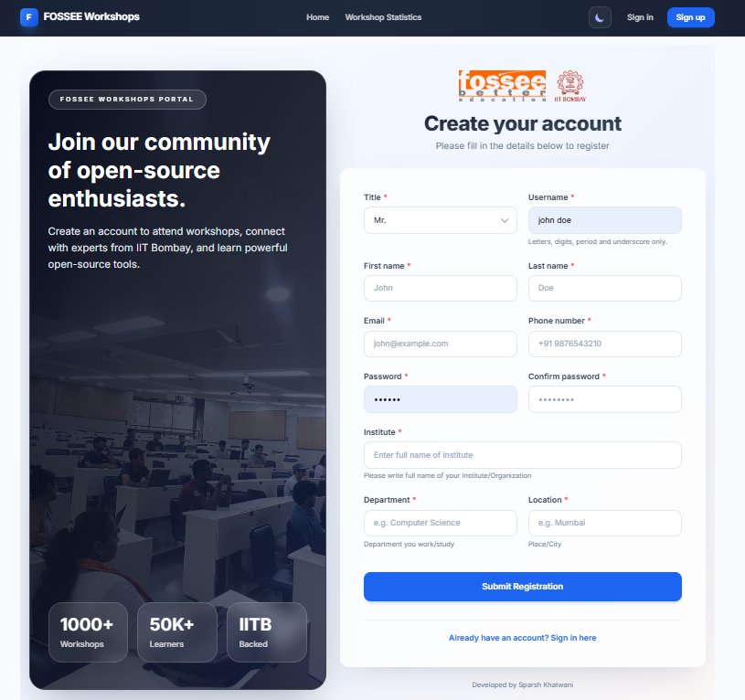

<br/>

**Forgot Password Before:**  
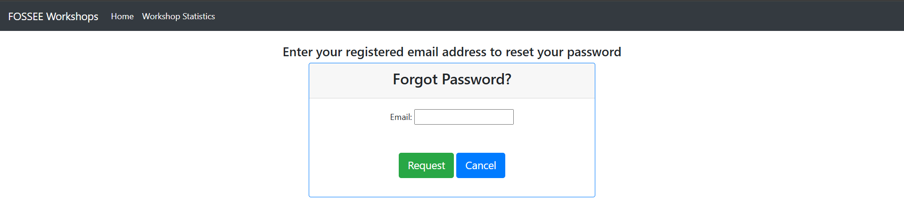

**Forgot Password After:**  
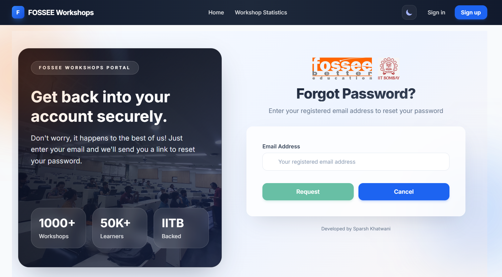

<br/>

**Responsiveness Demo:**  
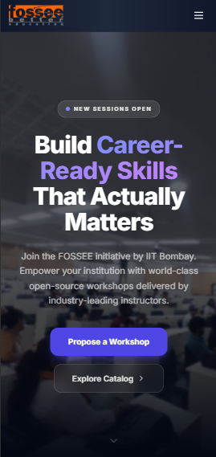
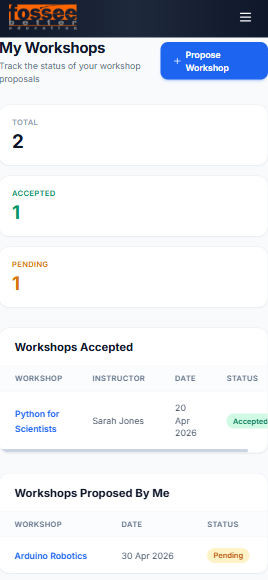
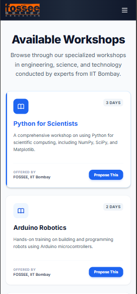

---

## 🛠️ Technical & Implementation Details

### 🤔 What design principles guided your improvements?
The primary principle was **Separation of Concerns**, cleanly decoupling the backend data layer (Django) from the presentation layer (React). On the UI side, the migration was guided by **Modern Minimalism** and **Component Reusability**.The redesign was rooted in the **Atomic Design Methodology**, where components were built from the ground up for maximum reusability. We emphasized **Visual Hierarchy** and **Information Density**, ensuring that complex data dashboards remain legible. By strictly adhering to a **Design Token System** via Tailwind CSS, we decoupled the UI logic from raw CSS, ensuring that the entire platform's aesthetic (from spacing to color contrast) can be updated from a single configuration file.

### 📲 How did you ensure responsiveness across devices?
We employed a **Fluid Design Strategy** combined with Tailwind's mobile-first breakpoint system. Instead of fixed widths, we used **relative sizing (REM/%)** and **CSS Grid** to ensure layouts "flow" naturally. For complex elements like the Statistics tables, we implemented **horizontal scrolling sub-containers** on mobile, while the Sidebar filters switch to a **collapsible drawer** to preserve vertical screen real-estate.

### ⚖️ What trade-offs did you make between the design and performance?
The primary trade-off was between **Initial Load Time and Run-time Fluidity**. By choosing a React-based SPA (Client-Side Rendering), we accepted a larger initial JS bundle compared to traditional Django templates. However, we mitigated this using **Vite's optimized tree-shaking** and asset compression. The result is a slightly longer "first-paint" but **instant transitions thereafter**, which is significantly more beneficial for a complex, data-heavy dashboard platform like this.

### 🧗 What was the most challenging part of the task and how did you approach it?
The most significant challenge was the **Architecture Decoupling**. Migrating from Django's session-based templates to a decoupled REST environment required a robust **Auth Context Management** system. We solved this by building a custom React Context provider that handles persistent authentication states, CSRF security handshakes, and role-based route guarding. This ensures that the frontend remains "stateless" while perfectly synchronized with the Backend's security layers.

---

## 📂 Project Structure

```bash
workshop_booking/
├── workshop_app/             # Core Django App (API views, Serializers, Models)
├── workshop_portal/          # Django Project Configuration & URLs
├── statistics_app/           # Statistics & Data Visualization logic
├── frontend/                 # Modern React SPA (Vite + Tailwind)
│   ├── src/
│   │   ├── api/              # Axios API layer (client.js)
│   │   ├── pages/            # View components (Home, Dashboards, Stats)
│   │   └── components/       # Reusable UI (Navbar, Footer, SEO)
│   └── tailwind.config.js    # Design system tokens
├── media/                    # Stored attachment files & sample docs
├── screenshots/              # UI enhancement visual assets
├── manage.py                 # Django management entry point
├── seed_data.py              # Functional script for sample data population
└── requirements.txt          # Python dependency list
```

---

## 🚀 Setup & Installation

Follow these steps to get the environment running locally:

### 🐍 1. Backend Setup (Django)
```bash
# 1. Create and activate a virtual environment 
python -m venv venv
venv\Scripts\activate # Windows

# 2. Install dependencies
pip install -r requirements.txt

# 3. Apply database migrations
python manage.py migrate

# 4. Generate Sample Data (Highly Recommended)
python seed_data.py

# 5. Start the backend development server
python manage.py runserver
```

### ⚛️ 2. Frontend Setup (React)
```bash
# 1. Move to the frontend directory
cd frontend

# 2. Install dependencies
npm install

# 3. Start the Vite development server
npm run dev
```

> ℹ️ Your React frontend will typically run on `http://localhost:5173` and communicate with the Django backend running on `http://localhost:8000`.

---
__NOTE__: Check `docs/Getting_Started.md` for more historical info on the backend architecture.

<br/>

## 👨‍🎓 Student Details

- **Name**: Sparsh Khatwani
- **Institution**: VIT Bhopal
- **Email**: [sparsh.khatwani@gmail.com](mailto:sparsh.khatwani@gmail.com)
- **Repository**: [sparshkhatwani/workshop_booking](https://github.com/sparshkhatwani/workshop_booking)

---
<div align="center">
  <p>Made with ❤️ for FOSSEE</p>
</div>