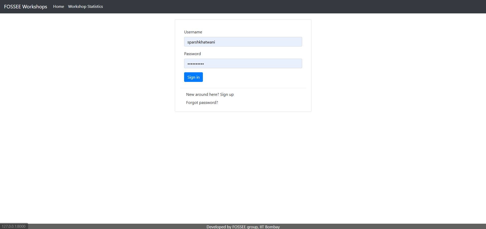
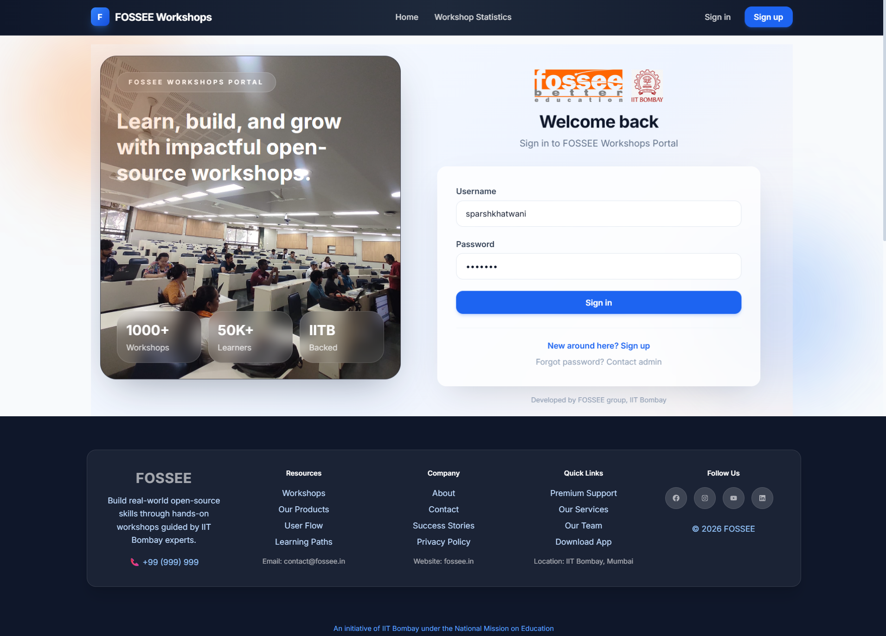
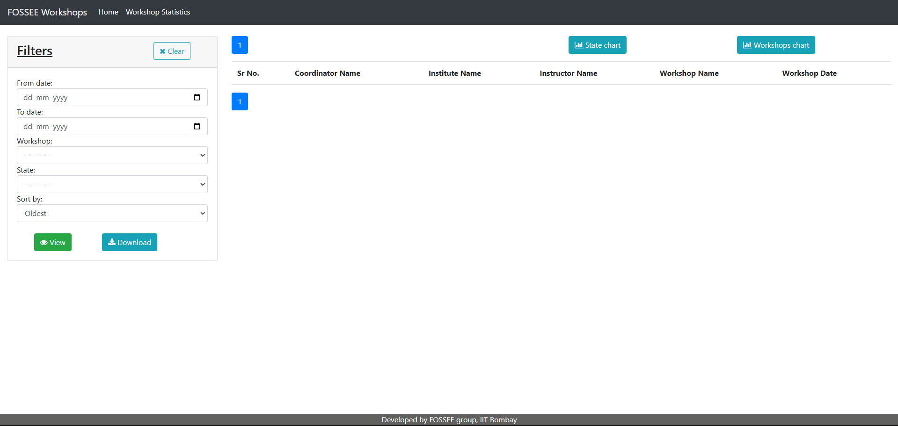
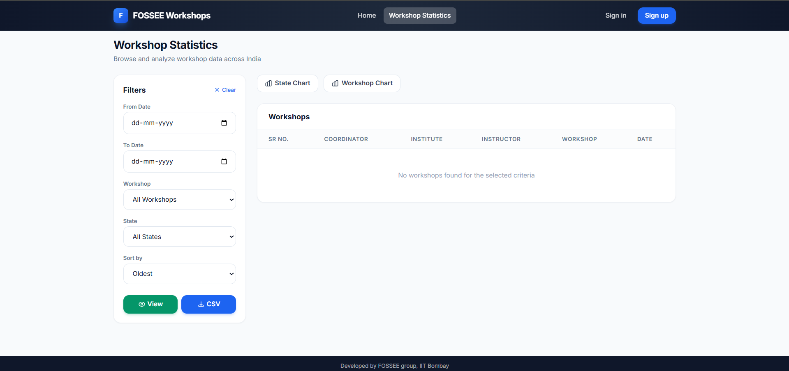
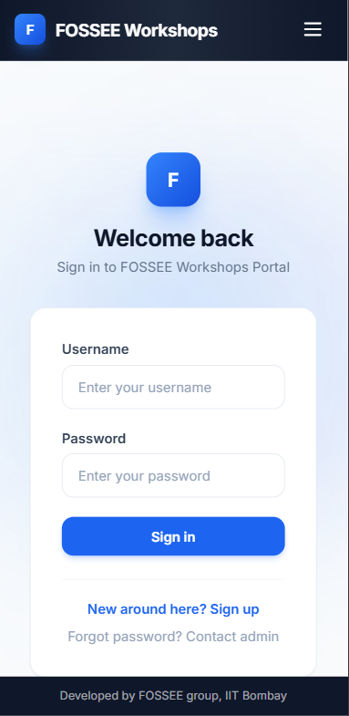
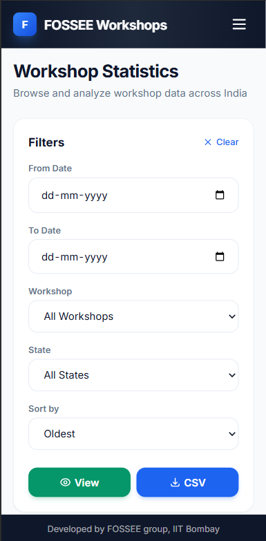

# UI/UX Enhancement Of Workshop Booking Platform

## Overview

This project focuses on improving the UI/UX of the existing Workshop Booking platform provided by FOSSEE. The goal was to enhance usability, responsiveness, and visual design while maintaining the core functionality of the application.

The redesign prioritizes clarity, accessibility, and a modern user experience, especially for mobile users.

---
## 🎨 Visual User Interface(UI) Upgrades
* **Modern Interface:** Transitioned the application to a modern frontend using React and Tailwind CSS.
* **Glassmorphic Footer:** Implemented a premium, glassmorphic footer with glowing gradient backgrounds (`backdrop-blur-xl`, `bg-white/5`), dramatically improving the lower page aesthetics.
* **Refined Typography & Spacing:** Upgraded global padding, margin, and max-widths (`max-w-7xl`, `mx-auto`) to ensure clear and responsive alignment across all device sizes.
* **Interactive Hover States:** Added smooth `scale` and color shift transitions on buttons, links, and social icons (e.g., `hover:scale-110`, `transition duration-300`).

## ⚡ User Experience (UX) Improvements
* **Seamless Navigation (SPA):** Utilizing `react-router-dom` for Single Page Application navigation ensures instant transitions between Login, Dashboard, and Statistics pages without full page reloads.
* **Role-Based Dashboards:** Dynamically serving either the `DashboardInstructor` or `DashboardCoordinator` depending on user role, simplifying the interface and putting relevant actions upfront.
* **Toast Notifications:** Integrated `react-hot-toast` with custom styling (success/error palettes) to provide users with immediate, beautiful, and non-intrusive feedback on their actions.
* **Elegant Loading States:** Created a dedicated, centered loading spinner sequence replacing abrupt layout shifts while authentication data is verified.
* **Protected Routes:** Unauthorized users are fluidly redirected back to Login rather than encountering broken empty pages.

## 🔍 Search Engine Optimization (SEO)
* **Dynamic Meta Tags:** Integrated `react-helmet-async` to dynamically inject page titles, descriptions, and keywords, improving search engine crawlability for the React SPA.
* **Open Graph & Twitter Cards:** Configured specialized meta attributes (`og:title`, `twitter:card`) inside a reusable `<SEO />` component to ensure optimal link previews when sharing the platform on social media like Facebook, LinkedIn, and Twitter.
* **Canonical Link Tagging:** Added dynamic `<link rel="canonical">` references to prevent duplicate content indexing issues across routes.

## 📱 Responsiveness
* **Mobile-First Grids:** The layout scales gracefully via Tailwind's `grid` and `md:grid-cols-5` utilities, ensuring it looks excellent on both mobile devices and wide desktop displays.

## Technical Reasoning & Implementation Details

### What design principles guided your improvements?
The primary principle was **Separation of Concerns**, cleanly decoupling the backend data layer (Django) from the presentation layer (React). On the UI side, the migration was guided by **Modern Minimalism** and **Component Reusability**. By utilizing Tailwind CSS, we established a strict, consistent design system (colors, typography, spacing) that ensures a cohesive look across the entire application while remaining easily maintainable.

### How did you ensure responsiveness across devices?
We implemented a **Mobile-First Approach**. Using Tailwind CSS's breakpoint utilities (like `md:`, `lg:`), the base design defaults to mobile-friendly layouts. Structure scales upward using **CSS Flexbox and CSS Grid** to smoothly transition components into multi-column layouts on tablets and large desktop monitors.

### What trade-offs did you make between the design and performance?
We opted for **Client-Side Rendering (CSR)** using React and Vite. The trade-off is a slightly larger initial JavaScript bundle payload on the first page load compared to traditional server-rendered Django templates. However, this is offset by vastly superior performance and highly dynamic design interactions during subsequent navigations, resulting in a significantly better overall User Experience (UX).

### What was the most challenging part of the task and how did you approach it?
The most challenging part of the decoupling was **migrating the tightly coupled Django view logic (like session-based authentication and context data) into stateless REST APIs**. 
We approached this by systematically stepping through the backend first: establishing Django Rest Framework (DRF), thoroughly testing isolated API endpoint responses using Serializers, mapping out Cross-Origin Resource Sharing (CORS), and finally wiring them securely into the React frontend.

---
## Before and After Screenshots

**Home Before:**  


**Home After:**  


**Workshop Statistics Before:**  


**Workshop Statistics After:**  


**Responsiveness Demo:**  




---

## Setup Instructions

This project is divided into two distinct applications: a Django Backend API and a React Frontend. You will need two terminals running simultaneously to start the project.

### 1. Backend Setup (Django)
Navigate to the root directory of the project.

```bash
# 1. Create and activate a virtual environment 
python -m venv venv
# On Windows:
venv\Scripts\activate
# On Mac/Linux:
# source venv/bin/activate

# 2. Install dependencies
pip install -r requirements.txt

# 3. Apply database migrations
python manage.py migrate

# 4. Start the backend development server
python manage.py runserver
```

### 2. Frontend Setup (React / Vite)
Open a new terminal and navigate to the `frontend` folder.

```bash
# 1. Move to the frontend directory
cd frontend

# 2. Install node module dependencies
npm install

# 3. Start the Vite development server
npm run dev
```

Your React frontend will typically run on `http://localhost:5173` and communicate with the Django backend running on `http://localhost:8000`.

---
__NOTE__: Check `docs/Getting_Started.md` for more historical info on the backend architecture.

## Student Details

Name: Sparsh Khatwani

Institution Name: VIT Bhopal

Email Id: sparsh.khatwani@gmail.com

College Email Id: sparsh.23bce10090@vitbhopal.ac.in


Repository link: *https://github.com/sparshkhatwani/workshop_booking*

---