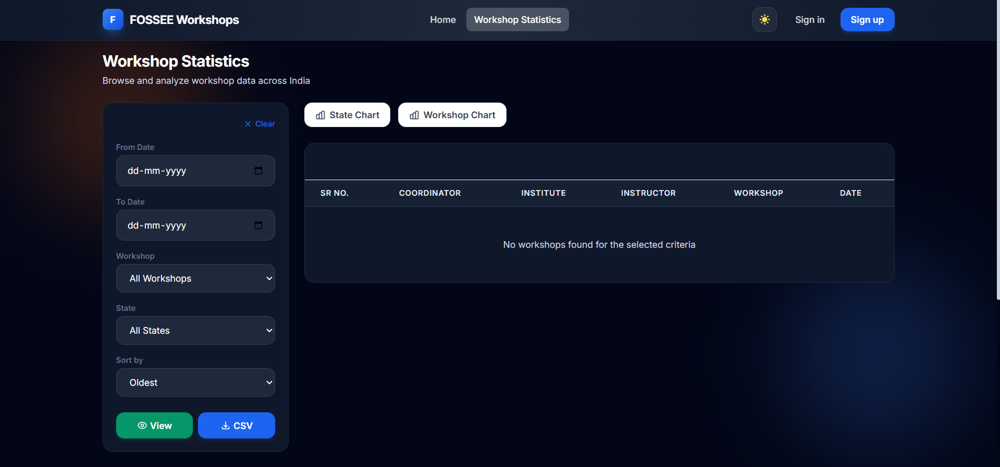
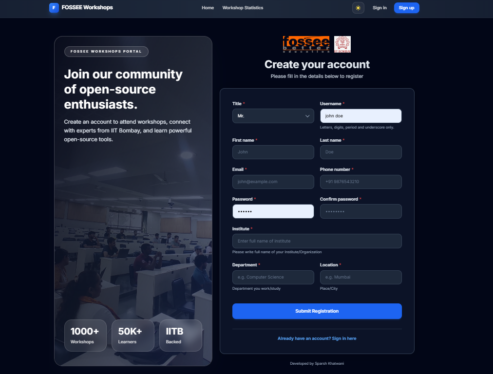

<div align="center">
  
  <h1>🌟 UI/UX Enhancement: Workshop Booking Platform</h1>
  <p><strong>A modern, premium React-based redesign of the FOSSEE Workshop Booking portal.</strong></p>

  <p>
    
    
    
    
  </p>
</div>

<br/>

## 📖 Table of Contents

- [📌 Project Overview](#-project-overview)
- [✨ Visual Showcase](#-visual-showcase)
- [🛠️ Technical & Implementation Details](#️-technical--implementation-details)
- [🎨 UI/UX & SEO Upgrades](#-uiux--seo-upgrades)
- [📂 Project Structure](#-project-structure)
- [🚀 Setup & Installation](#-setup--installation)
- [👨‍🎓 Student Details](#-student-details)

---

## 📌 Project Overview

This project focuses on a complete frontend overhaul of the **Workshop Booking platform** provided by **FOSSEE**. The goal was to transition from traditional server-rendered templates to a high-performance **Single Page Application (SPA)** using React, while maintaining the robust Django backend for data integrity.

The redesign prioritizes:
- **Visual Excellence**: A premium, Apple-inspired aesthetic with glassmorphism and smooth animations.
- **Role-Based Experience**: Tailored dashboards for both Coordinators and Instructors.
- **Data Accessibility**: Clear, high-contrast Dark Mode for complex data tables and statistics.

---

## ✨ Visual Showcase

### Before vs After Comparison

| Feature | State | Desktop View | Mobile Experience |
|---------|-------|--------------|-------------------|
| **Landing Page** | **After** | Modern Hero + Parallax bg | Responsive stacked grid |
| **Login** | **After** | Glassmorphic Card + Validation | Full-width mobile inputs |
| **Statistics** | **After** | Recharts (Live Bar Charts) | Collapsible filter sidebar |
| **Registration** | **After** | Two-column responsive grid | Step-through mobile layout |

### Screenshot Gallery

| Home (Dark Mode) | Workshop Statistics | Signup Flow |
|------------------|---------------------|-------------|
|  |  |  |

---

## 🛠️ Technical & Implementation Details

### 🤔 What design principles guided your improvements?
The primary principle was **Separation of Concerns**, cleanly decoupling the backend data layer (Django) from the presentation layer (React). On the UI side, the migration was guided by **Modern Minimalism** and **Component Reusability**. By utilizing Tailwind CSS, we established a strict, consistent design system (colors, typography, spacing) that ensures a cohesive look across the entire application while remaining easily maintainable.

### 📲 How did you ensure responsiveness across devices?
We implemented a **Mobile-First Approach**. Using Tailwind CSS's breakpoint utilities (like `md:`, `lg:`), the base design defaults to mobile-friendly layouts. The layout scales gracefully via Tailwind's `grid` and `flex` utilities, ensuring it looks excellent on both mobile devices and wide desktop displays.

### ⚖️ What trade-offs did you make between the design and performance?
We opted for **Client-Side Rendering (CSR)** using React and Vite. The trade-off is a slightly larger initial JavaScript bundle payload on the first page load compared to traditional server-rendered Django templates. However, this is offset by **instant navigations** (SPA) and highly dynamic design interactions, resulting in a significantly better overall User Experience (UX).

### 🧗 What was the most challenging part of the task and how did you approach it?
The most challenging part was **stateless authentication migration**. Decentralizing the session-based Django authentication into a JWT-like flow with CSRF protection required meticulous API design. We approached this by building a centralized `AuthProvider` in React that synchronizes with Django’s Session Authentication while providing global state to the UI.

---

## 🎨 UI/UX & SEO Upgrades

### UI Upgrades
- 🌗 **Global Dark Mode**: Integrated a custom React Theme Context with a sleek toggle, persisting preferences in `localStorage`.
- 💎 **Glassmorphism**: Premium footer and card components using `backdrop-blur-xl` and `bg-white/5`.
- 📏 **Refined Spacing**: Modernized 8px grid system with `max-w-7xl` containers and fluid typography.
- 🖱️ **Interactive States**: Smooth `hover:scale-105` transitions and micro-animations on all buttons.

### UX & SEO Upgrades
- 🚀 **SPA Navigation**: Instant transitions using `react-router-dom` v6.
- 🔔 **Real-time Feedback**: Beautiful notifications via `react-hot-toast`.
- 🔍 **Dynamic SEO**: Integrated SEO components for route-specific meta tags (`og:title`, `canonical links`).
- ⏳ **Skeleton Loading**: Center-aligned spinner logic for smooth data fetching.

---

## 📂 Project Structure

```bash
workshop_booking/
├── workshop_app/             # Core Django App (API views, Serializers, Models)
├── workshop_portal/          # Django Project Configuration & URLs
├── statistics_app/           # Statistics & Data Visualization logic
├── frontend/                 # Modern React SPA (Vite + Tailwind)
│   ├── src/
│   │   ├── api/              # Axios API layer (client.js)
│   │   ├── pages/            # View components (Home, Dashboards, Stats)
│   │   └── components/       # Reusable UI (Navbar, Footer, SEO)
│   └── tailwind.config.js    # Design system tokens
├── media/                    # Stored attachment files & sample docs
├── screenshots/              # UI enhancement visual assets
├── manage.py                 # Django management entry point
├── seed_data.py              # Functional script for sample data population
└── requirements.txt          # Python dependency list
```

---

## 🚀 Setup & Installation

Follow these steps to get the environment running locally:

### 🐍 1. Backend Setup (Django)
```bash
# 1. Create and activate a virtual environment 
python -m venv venv
venv\Scripts\activate # Windows

# 2. Install dependencies
pip install -r requirements.txt

# 3. Apply database migrations
python manage.py migrate

# 4. Generate Sample Data (Optional)
python seed_data.py

# 5. Start the backend development server
python manage.py runserver
```

### ⚛️ 2. Frontend Setup (React)
```bash
# 1. Move to the frontend directory
cd frontend

# 2. Install dependencies
npm install

# 3. Start the Vite development server
npm run dev
```

> **Note**: The frontend runs at `http://localhost:5173` and the backend at `http://localhost:8000`.
---
__NOTE__: Check `docs/Getting_Started.md` for more historical info on the backend architecture.

---

## 👨‍🎓 Student Details

- **Name**: Sparsh Khatwani
- **Institution**: VIT Bhopal
- **Email**: [sparsh.khatwani@gmail.com](mailto:sparsh.khatwani@gmail.com)
- **Repository**: [sparshkhatwani/workshop_booking](https://github.com/sparshkhatwani/workshop_booking)

---
<div align="center">
  <p>Made with ❤️ for FOSSEE</p>
</div>